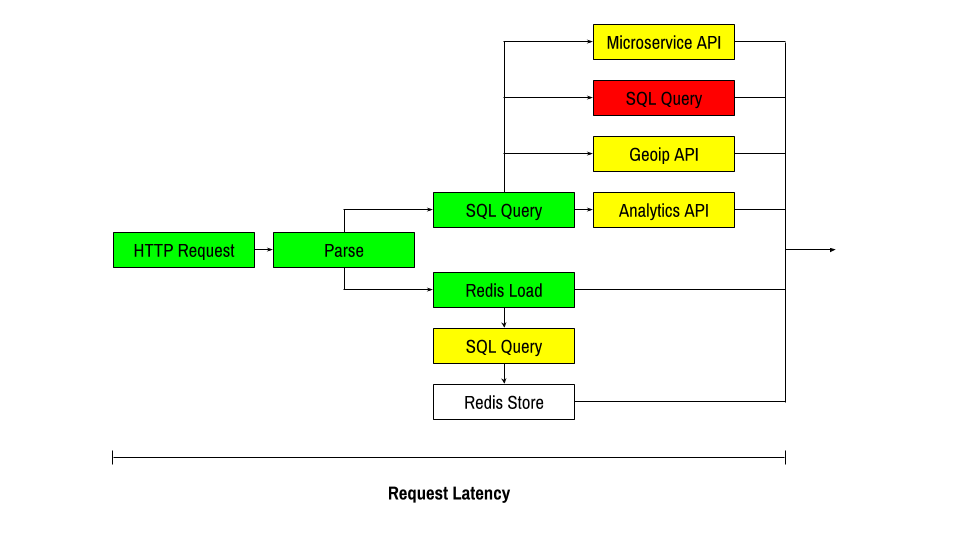
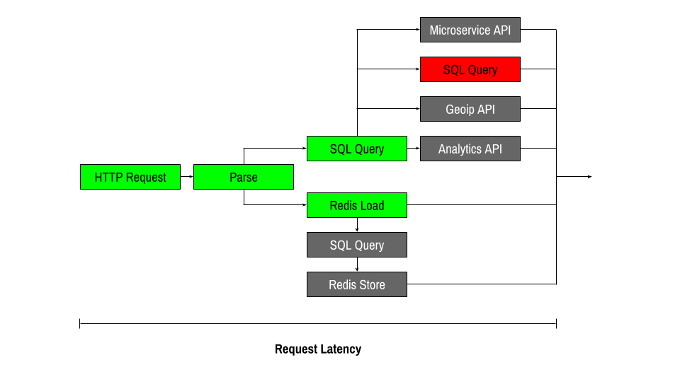

autoscale: true

# *Fast, Concurrent IO with Scalaz 8*
### Winter Retreat 2018 - Whistler, BC, Canada

#### John A. De Goes
#### @jdegoes - http://degoes.net

---

# *Agenda*

 * Intro
 * Tour
 * Hands-On
 


---

# [fit] Business Scenario

---


---



---



---

# *4 Monster Pains*

1. Asynchronous
2. Concurrent
3. Resource-Safe
4. Performant

---

# *Scalaz 8 Effect*
#### `import scalaz.effect._`

#### Scalaz 8 effect system is a small, composable collection of data types and type classes that help developers build principled, performant, and pragmatic I/O applications that don't leak resources, don't block, and scale across cores.

---

# Scalaz 8 IO
## *The Heart of Scalaz 8*

#### `IO[A]` is an immutable value that describes an effectful program that either produces an `A`, fails with a `Throwable`, or runs forever.

---

# *TLDR*

Scalaz 8 `IO` helps you quickly build *asynchronous*, *concurrent*, *leak-free*, *performant* applications.[^2]

[^2]: Which coincidentally *happen* to be type-safe, purely functional, composable, and easy to reason about.

---

# [fit] *Tour*

---

# Main
## *Safe App*

```scala
object MyApp extends SafeApp {
  def run(args: List[String]): IO[Unit] =
    for {
      _ <- putStrLn("Hello! What is your name?")
      n <- getStrLn
      _ <- putStrLn("Hello, " + n + ", good to meet you!")
    } yield ()
}
```

---

# Core
## *Pure Values*

```scala
object IO {
  ...
  def point[A](a: => A): IO[A] = ???
  ...
}
...
val answer: IO[Int] = IO.point(42)
```

---

# Core
## *Mapping*

```scala
trait IO[A] {
  ...
  def map[B](f: A => IO[B]): IO[B] = ???
}
...
IO.point(2).map(_ * 3) // IO.point(6)
```

---

# Core
## *Chaining*

```scala
trait IO[A] {
  ...
  def flatMap[B](f: A => IO[B]): IO[B] = ???
}
...
IO.point(2).flatMap(x => IO.point(3).flatMap(y => IO.point(x * y)) // IO.point(6)
```

---

# Core
## *Failure*

```scala
object IO {
  ...
  def fail[A](t: Throwable): IO[A] = ???
  ...
}
...
val failure = IO.fail(new Error("Oh noes!"))
```

---

# Core
## *Recovery*

```scala
trait IO[A] {
  ...
  def attempt: IO[Throwable \/ A] = ???
  ...
}
...
action.attempt.flatMap {
  case -\/ (error) => IO.point("Uh oh!")
  case  \/-(value) => IO.point("Yay!")
}
```

---

# Core
## *Deriving Absolve*

```scala
object IO {
  ...
  def absolve[A](io: IO[Throwable \/ A]): IO[A] = io.flatMap {
    case -\/ (error) => IO.fail(error)
    case  \/-(value) => IO.point(value)
  }
  ...
}
...
IO.absolve(action.attempt)
```

---

# Core
## *Deriving Alternative*

```scala
trait IO[A] {
  ...
  def orElse(that: => IO[A]): IO[A] = 
  	self.attempt.flatMap(_.fold(_ => that)(IO.point))
  ...
}
...
val openAnything = openFile("primary.data").orElse(openFile("secondary.data"))
```

---

# Synchronous
## *Importing Effects*

```scala
object IO {
  ...
  def sync[A](a: => A): IO[A] = ???
  ...
}
```

---

# Synchronous
## *Importing Example*

```scala
def putStrLn(line: String): IO[Unit] = 
  IO.sync(scala.Console.println(line))
  
def getStrLn: IO[String] = 
  IO.sync(scala.io.StdIn.readLine())
```

---

# Synchronous
## *Effect Example*

```scala
val program: IO[Unit] =
  for {
    _    <- putStrLn("Hello. What is your name?")
    name <- getStrLn
    _    <- putStrLn("Hello, " + name + ", good to meet you!")
  } yield ()  
```

---

# Asynchronous
## *Effect Import: Definition*

```scala
object IO {
  ...
  def async0[A](k: (Throwable \/ A => Unit) => AsyncReturn[A]): IO[A] = ???
  ...
}
...
sealed trait AsyncReturn[+A]
object AsyncReturn {
  final case object Later extends AsyncReturn[Nothing]
  final case class Now[A](value: A) extends AsyncReturn[A]
  final case class MaybeLater[A](canceler: Throwable => Unit) extends AsyncReturn[A]
}
```

---

# Asynchronous
## *Importing Effects*

```scala
def spawn[A](a: => A): IO[A] = 
  IO.async0 { (callback: Throwable \/ A => Unit) =>
    java.util.concurrent.Executors.defaultThreadFactory.newThread(new Runnable() {
      def run(): Unit = callback(\/-(a))
    })
    AsyncReturn.Later
  }  

def never[A]: IO[A] = 
  IO.async0 { (callback: Throwable \/ A => Unit) =>
    AsyncReturn.Later
  }
```

---

# Asynchronous
## *Effect Example*

```scala
for {
  response1 <- client.get("http://e.com")
  limit = parseResponse(response1).limit
  response2 <- client.get("http://e.com?limit=" + limit)
} yield parseResponse(response2)
```

--- 

# Asynchronous
## *Sleep*

```scala
IO {
  ...
  def sleep(duration: Duration): IO[Unit] = ???
  ...
}
```

--- 

# Asynchronous
## *Sleep Example*

```scala
for {
  _ <- putStrLn("Time to sleep...")
  _ <- IO.sleep(10.seconds)
  _ <- putStrLn("Time to wake up!")
} yield ()
```

---

# Asynchronous
## *Deriving Delay*

```scala
trait IO[A] {
  ...
  def delay(duration: Duration): IO[A] =
    IO.sleep(duration).flatMap(_ => self)
  ...
}
...
putStrLn("Time to wake up!").delay(10.seconds)
```

---

# Concurrency
## *Models*

 1. **Threads — Java**
    * OS-level
 	* Heavyweight
 	* Dangerous interruption
 2. ~~**Green Threads — Haskell**~~
    * Language-level
    * Lightweight
    * Efficient
 3. **Fibers — Scalaz 8**
    * Application-level
    * Lightweight
    * Zero-cost for pure FP
    * User-defined semantics

---

# Concurrency
## *Fork/Join*

```scala
trait IO[A] {
  ...
  def fork: IO[Fiber[A]] = ???
  
  def fork0(h: Throwable => IO[Unit]): IO[Fiber[A]] = ???
  ...
}
trait Fiber[A] {
  def join: IO[A]
  def interrupt(t: Throwable): IO[Unit]
}
```

---

# Concurrency
## *Fork/Join Example*

```scala
def fib(n: Int): IO[BigInt] =
  if (n <= 1) IO.point(n) 
  else for {
    fiberA <- fib(n-1).fork
    fiberB <- fib(n-2).fork
    a      <- fiberA.join
    b      <- fiberB.join
  } yield a + b
```

---

# Concurrency
## *raceWith*

```scala
trait IO[A] {
  ...
  def raceWith[B, C](that: IO[B])(
    finish: (A, Fiber[B]) \/ (B, Fiber[A]) => IO[C]): IO[C] = ???
  ...
}
```

---

# Concurrency
## *Deriving Race*

```scala
trait IO[A] {
  ...
  def race(that: IO[A]): IO[A] = raceWith(that) {
    case -\/ ((a, fiber)) => fiber.interrupt(Errors.LostRace( \/-(fiber))).const(a)
    case  \/-((a, fiber)) => fiber.interrupt(Errors.LostRace(-\/ (fiber))).const(a)
  }
  ...
}
```

---

# Concurrency
## *Deriving Timeout*

```scala
trait IO[A] {
  ...
  def timeout(duration: Duration): IO[A] = {
    val err: IO[Throwable \/ A] = 
      IO.point(-\/(Errors.TimeoutException(duration)))

    IO.absolve(self.attempt.race(err.delay(duration)))
  }
  ...
}
```

---

# Concurrency
## *Deriving Par*

```scala
trait IO[A] {
  ...
  def par[B](that: IO[B]): IO[(A, B)] = 
  	attempt.raceWith(that.attempt) {
      case -\/ ((-\/ (e), fiberb)) => fiberb.interrupt(e).flatMap(_ => IO.fail(e))
      case -\/ (( \/-(a), fiberb)) => IO.absolve(fiberb.join).map(b => (a, b))
      case  \/-((-\/ (e), fibera)) => fibera.interrupt(e).flatMap(_ => IO.fail(e))
      case  \/-(( \/-(b), fibera)) => IO.absolve(fibera.join).map(a => (a, b))
    }
  ...
}
```

---

# Concurrency
## *Deriving Retry*

```scala 
trait IO[A] {
  ...
  def retry: IO[A] = this orElse retry

  def retryN(n: Int): IO[A] =
    if (n <= 1) this
    else this orElse (retryN(n - 1))

  def retryFor(duration: Duration): IO[A] =
    IO.absolve(
      this.retry.attempt race 
        (IO.sleep(duration) *>
         IO.point(-\/(Errors.TimeoutException(duration)))))
  ...
}
```

---

# Concurrency
## *MVar*

```scala
trait MVar[A] {
  def peek: IO[Maybe[A]] = ???
  def take: IO[A] = ???
  def read: IO[A] = ???
  def put(v: A): IO[Unit] = ???
  def tryPut(v: A): IO[Boolean] = ???
  def tryTake: IO[Maybe[A]] = ???
}
```

---
# Concurrency
## *MVar Example*


```scala
val action = 
  for {
    mvar   <- MVar.empty          // Fiber 1
    _      <- mvar.putVar(r).fork // Fiber 2
    result <- mvar.takeVar        // Fiber 1
  } yield result
```

---

# [fit] *Coming Soon*: Real STM

---

# Resource Safety
## *Uninterruptible*

```scala
trait IO[A] {
  ...
  def uninterruptibly: IO[A] = ???
  ...
}
```

---

# Resource Safety
## *Uninterruptible Example*

```scala
val action2 = action.uninterruptibly
```

---

# Resource Safety
## *Bracket*

```scala
trait IO[A] {
  ...
  def bracket[B](
    release: A => IO[Unit])(
      use: A => IO[B]): IO[B] = ???
  ...
}
```

---

# Resource Safety
## *Bracket Example*

```scala
def openFile(name: String): IO[File] = ???
def closeFile(file: File): IO[Unit] = ???

openFile("data.json").bracket(closeFile(_)) { file =>
  ...
  // Use file
  ...
}
```


---

# Resource Safety
## *Bracket*

```scala
trait IO[A] {
  ...
  def bracket[B](
    release: A => IO[Unit])(
      use: A => IO[B]): IO[B] = ???
  ...
}
```

---

# Resource Safety
## *Deriving 'Finally'*

```scala
trait IO[A] {
  def ensuring(finalizer: IO[Unit]): IO[A] =
    IO.unit.bracket(_ => finalizer)(_ => this)
}
```


---

# Resource Safety
## *Broken Error Model*

```scala
try {
  try { 
    try {
      throw new Error("e1")
    }
    finally {
      throw new Error("e2")
    }
  }
  finally {
    throw new Error("e3")
  }
}
catch { case e4 : Throwable => println(e4.toString()) }
```

---

# Resource Safety
## *Fixed Error Model*

```scala
IO.fail(new Error("e1")).ensuring(
  IO.fail(new Error("e2"))).ensuring(
    IO.fail(new Error("e3"))).catchAll(e => putStrLn(e.toString())) 
```

---

# Resource Safety
## *Supervision*

```scala
object IO {
  ...
  def supervise[A](io: IO[A]): IO[A] = ???
  ...
}
```

---

# Resource Safety
## *Supervision Example*

```scala
val action = IO.supervise {
  for {
    a <- doX.fork
    b <- doY.fork
    ...
  } yield z
}
```

---

# Principles
## *Algebraic Laws* 


```haskell
fork >=> join = id

let fiber = fork never
in interrupt e fiber >* join fiber = fail e
```

And many more!

---

# [fit] *This is War*

---

# [fit] *Hands-On*


